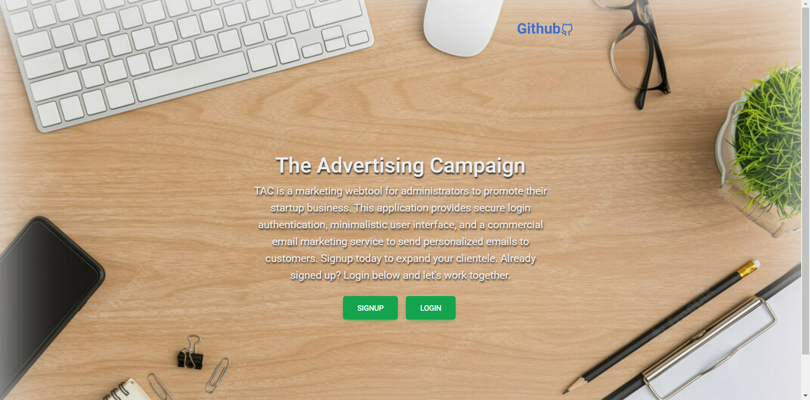

# Group 4: Full-Stack Project | The Advertising Campaign [TAC]
 

## License | Badges:


---

## Table of Contents:

- [License](#license)
- [Team](#team)
- [User Story](#user-story)
- [Usage](#usage)
- [Technologies](#technologies)
- [Screenshot](#screenshot)
- [Deployed URL](#deployed-url)
- [Questions](#questions)

---

## User Story:

```md
AS a business want to send a customized email to an individual or to multiple client/ friend
They  WANT an application can provide them a service to be able to send emails from the server
SO THAT They can promote their business, and their new products to their clients
```

---

## Usage:

```md
GIVEN an online advertising application (TAC)
WHEN the user visit the site for the first time
THEN the user will see Join Today which directs the user to the sign up page
THEN the user needs to create an account, which requires username, email and password; if the user has created an account previously and there is an option to log in from the navbar
WHEN the user click on the TAC from the navbar
THEN the user can view our homepage about our application intro
WHEN the user click on create ADs
THEN the user can start creating their customized email to the desired clients
WHEN the user agrees to receive ADs from others by consenting their emails to public
THEN other user can send ADs to those users who agree to receive ADs and to their desired clients at the sam time
WHEN the user revisit the site at a later time and choose to sign in
THEN the user prompted to enter their email and password
WHEN the user signed in to the site
THEN the user see navigation links for the homepage, the dashboard, and the option to log out
```
---

## Technologies:

- `JavaScript`
- `Node.js`
- `Mailjet API`
- `Express.js`
- `Handlebars.js`
- `GET routes`
- `POST routes`
- `MVC Paradigm`
- `Handlebars.js`
- `Sequelize ORM`
- `User Authentication (express-session and cookies)`
- `MySQL Database`

---
## Screenshot: 
<!-- // Need to add screenshot based on the requirement -->


---
## Deployed URL:

- [Github Repository URL](https://github.com/DayneLalmond/fullstack_project)
- [Heroku Deployed URL](https://enigmatic-fortress-43863.herokuapp.com/)

---

## Questions:

If you have any questions about this project, please feel free to contact us!

- Dayne Lalmond: [dlalmondo@gmail.com](mailto:dlalmondo@gmail.com)
- Myles Horton: [myleshorton1442@gmail.com](mailto:myleshorton1442@gmail.com)
- Joyce Chen: [joyceideas@outlook.com](mailto:joyceideas@outlook.com)

---

